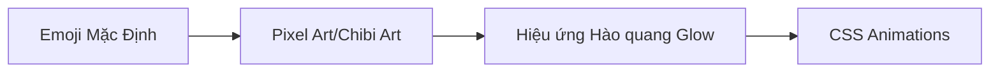

# Kế hoạch Phát triển Hệ thống Thú cưng (Pet System Roadmap)

Hệ thống Pet hiện tại đã có khung tính năng cốt lõi (Cho ăn, Tích lũy XP, Thăng cấp, Trang bị phụ kiện, Đổi thú cưng). Để sản phẩm đạt độ hoàn thiện cao nhất, tăng tương tác và tạo sự hào hứng cho học sinh cấp 2, chúng tôi đề xuất lộ trình phát triển gồm **3 Giai đoạn** dưới đây:

---

## Giai đoạn 1: Nâng cấp Đồ họa & Hiệu ứng Động (Thị giác & WOW Factor)

Mục tiêu là mang lại cảm giác sống động, hiện đại và cao cấp ngay từ cái nhìn đầu tiên.

### 1. Thay thế Emoji bằng Đồ họa Chibi / Pixel Art
* Thay vì ký tự emoji hệ thống, thiết kế/tải bộ ảnh định dạng **SVG** hoặc **PNG trong suốt** chất lượng cao:
  * **Cyber Cat**: Mèo máy siêu nhân, mèo phi hành gia.
  * **PyDragon**: Bộ sưu tập rồng lửa từ quả trứng nứt, rồng con dễ thương đến rồng chiến binh rực lửa.
  * **Algorithm Owl**: Cú thông thái từ chú chim non đội vỏ trứng đến cú tốt nghiệp đại học đeo kính cực ngầu.

### 2. Bổ sung CSS Micro-Animations
* Tạo cảm giác thú cưng đang "thở", nhún nhảy nhẹ nhàng bằng CSS Keyframes (`float`, `bounce`, `pulse`).
* Thêm hiệu ứng lắc lư hay vui sướng khi Pet được cho ăn thành công, hoặc hiệu ứng ủ rũ khi Pet đói.

### 3. Hiệu ứng Hào quang (Level Glow & Tier Effects)
* Thêm viền bóng neon hoặc tia sáng lấp lánh xung quanh Pet:
  * **Level 1-4**: Hào quang xanh lá nhẹ.
  * **Level 5-9**: Hào quang xanh dương/tím huyền ảo.
  * **Level 10+**: Tia sét hoặc lửa đỏ rực cực VIP (phù hợp với sở thích thể hiện cá tính của cấp 2).

---

## Giai đoạn 2: Động hóa Hệ thống Tiến hóa (Quản lý từ DB)

Tách toàn bộ ngưỡng thăng cấp và hình ảnh tiến hóa khỏi frontend cứng, quản lý thông qua cơ sở dữ liệu.

| Trường thông tin (Bảng `pet_templates`) | Mục đích sử dụng |
| :--- | :--- |
| `level_teen_threshold` | Cấp độ tiến hóa lên dạng Thiếu niên (Mặc định: 3) |
| `level_adult_threshold` | Cấp độ tiến hóa lên dạng Trưởng thành (Mặc định: 7) |
| `level_master_threshold` | Cấp độ tiến hóa lên dạng Trưởng lão (Mặc định: 12) |
| `base_xp_formula` | Công thức tính XP tăng dần cho mỗi cấp độ tiếp theo |

* **Lợi ích**: Dễ dàng chỉnh sửa cân bằng game (Game Balance) trực tiếp bằng SQL/Admin Dashboard mà không cần build hay deploy lại code frontend.

---

## Giai đoạn 3: Tương tác Xã hội & Cơ chế Học tập Sâu

Tăng tính gắn kết giữa thú cưng và việc học tập hàng ngày của học sinh.

### 1. Hệ thống Nhiệm vụ Thú cưng (Pet Quests)
* Hàng ngày, Pet sẽ đưa ra 1-2 yêu cầu đặc biệt như: *"Hôm nay tớ muốn ăn món Algorithm Owl, cậu hãy giải đúng 2 bài Python nhé!"* hoặc *"Giải quyết 1 thử thách khó để tớ nhận gấp đôi XP!"*
* Học sinh hoàn thành nhiệm vụ sẽ giúp Pet tăng cấp nhanh hơn 200%.

### 2. Tính năng "Khoe Pet" & Đấu trường Trí tuệ (Social & PvP Lite)
* **Thẻ khoe Pet (Pet Card)**: Học sinh có thể xuất ảnh/thẻ avatar Pet của mình (kèm theo các phụ kiện hiếm đã trang bị) lên bảng xếp hạng hoặc chia sẻ lên nhóm lớp.
* **Đại chiến Trí tuệ (Coding Arena)**: Học sinh sử dụng Pet của mình để thách đấu giải bài tập code nhanh với bạn bè cùng lớp. Sức mạnh hoặc trang phục của Pet sẽ mang lại các hiệu ứng phụ trợ đẹp mắt trong trận đấu.
